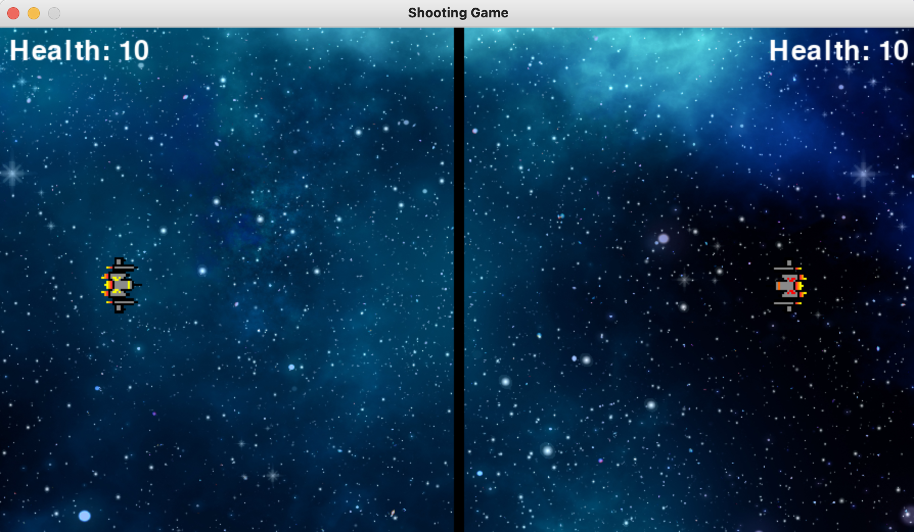

# Space Shooter Game
This is a 2D space shooter game made using pygame module. It is a simple game that python beginners can try out.

## Steps to Run
1. Download the file from the repo.
2. Make sure that the source code and the Assets folder are in a single common folder.
3. Install 'pygame' module.
4. Run the code.

## Screenshot

