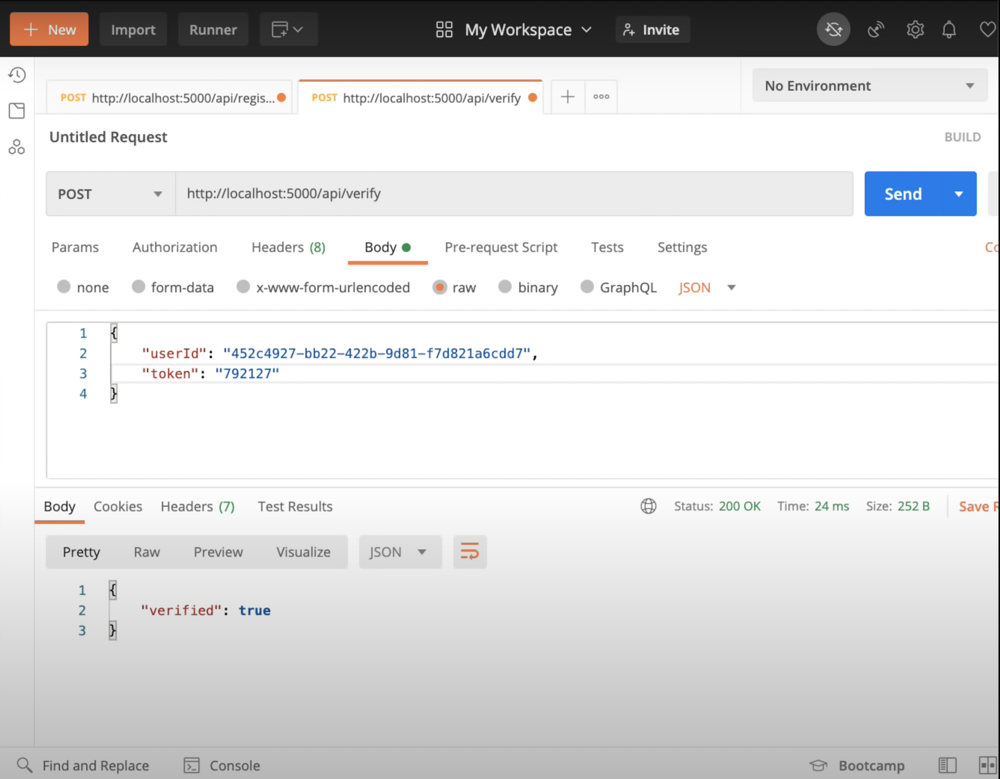

# Two Factor Authentication
A simple server implementation for setting up two factor authentication made using node.js and speakeasy.

## Working
1. Install Node.JS in your system.
2. Create a node project.
3. Install some dependencies  
   _npm init -y  
   _npm i express speakeasy uuid node-json-db_
4. Firstly create database here I am Node JSON database you can use any database that you want.
5. Now register the user and create a temporary secret.
6. When you will register the user you will get a secret key and token that will look like this in base32. 
7. Use the chrome extension that takes the secret key from the register process and gives you a token or you can also use the mobile app.
8. If it return verified true then you are good to go otherwise no.

## Screenshot

