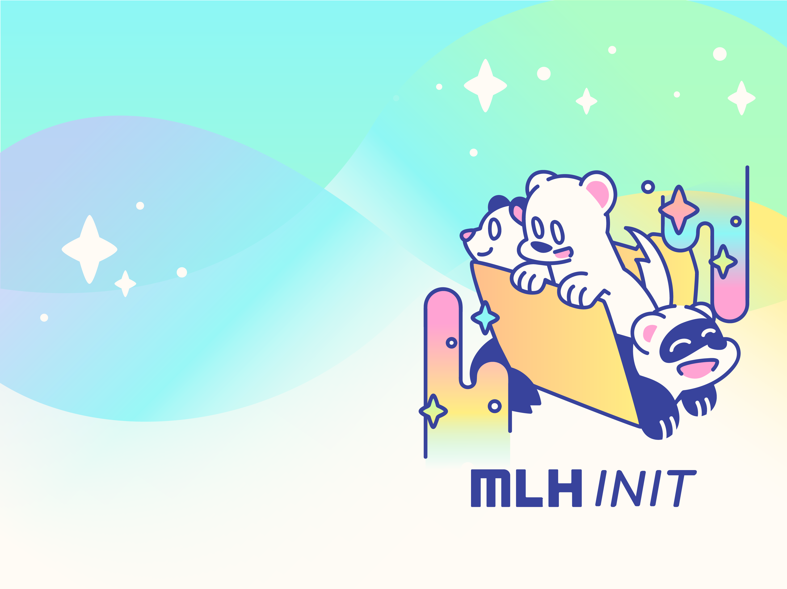

# MLH INIT 2022

## What is INIT?
INIT is a celebration for the start of the 2022 Hackathon Season! While this is the first time we are running INIT, the format will feel familiar to those who have participated in Local Hack Day. You can expect to complete challenges, hear about BIG community announcements, chat at hacker hangouts, enjoy fun live sessions, and make new memories (and memes). 

## Challenges
At MLH INIT, we will have plenty of week-long and daily challenges to keep you busy. Week-long challenges will be accessible for the entire week, so you can hack on them whenever you have free time. Daily challenges are only available for 24 hours after they’re originally posted, so make sure you come back each day to see which challenges you’re going to conquer.  
‍ 
Challenges will range from social challenges urging you to connect with other members of the community, technical challenges that will expand your coding skills, and design challenges to refine your skills as a creator and artist. Some of these challenges will be completed live on our twitch stream, so you can follow along and complete it with the community. We cannot wait to see all that you learn, build, and share.

## Guilds
One of the best parts of our community is that it allows people to meet and make connections with others, regardless of where you live. Form a guild of hackers and fight for a spot on the leaderboard. Who wouldn’t want bragging rights for having one of the most active guilds within the MLH community?  
‍ 
Everytime you complete a challenge during the week of INIT, you’ll earn points for yourself and your guild. There’s strength in numbers, so here are some pre-made marketing templates. Remember, sharing is caring - so use these to share the excitement with your local community, friends, and classmates!  The more members your guild has, the more points you’ll earn and the faster you’ll climb your way up the leaderboard. 

## Points
Earn points for yourself and your guild by completing our challenges throughout INIT. Challenges aren’t the only way to earn points. You can also receive a point each time you check in for a live session, so the more you attend, the more points you’ll rack up. Learn more about our challenges here. They can be as simple as posting on your social media or as advanced as building a project and creating a full demo video for it. We’ll leave it to you to choose which challenges you want to take on. Feel free to work collaboratively with others on these.
